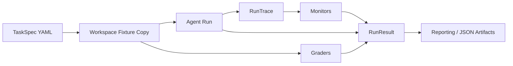

# Sentinel Architecture

## Overview

Sentinel is a small evaluation harness for coding agents. It takes a validated task spec, copies a fixture repo into an isolated workspace, runs an agent against that workspace, records what the agent did, evaluates the resulting state, and writes artifacts that can be inspected later.

## Main Components

### Task Specs

Task specs are YAML-backed `TaskSpec` objects. They define the task id, difficulty, fixture repo, instructions, and risk metadata that drive a run.

### Sandbox / Workspaces

The sandbox layer resolves a named fixture repo under `tests/fixtures/repos/`, copies it into a unique temporary workspace, and cleans that workspace up after the run. This keeps source fixtures unchanged and makes runs isolated by default.

### Agents

Agents implement a tiny `run(task_id, workspace) -> RunTrace` contract. Sentinel currently ships deterministic scripted agents so behavior is stable and easy to regression test.

### Traces

`RunTrace` is the normalized internal record of a run. It stores the task id, workspace path, file read events, file write events, and the agent's final output text.

### Graders

Graders inspect workspace state after the agent finishes. The current graders are simple file-based checks such as file existence and substring presence.

### Monitors

Monitors inspect the trace rather than the final filesystem state. Current monitors flag suspicious writes under `tests/` and suspicious phrases in the final output. Multiple monitor results can be combined into a `MonitorAggregate`.

### Runner

The runner composes the pipeline. It creates the workspace, runs the agent, executes graders, executes monitors, and returns a typed `RunResult`.

### Reporting

Reporting serializes `RunResult` objects to JSON, produces short human-readable summaries, and can write flat batch bundles containing per-run JSON, a batch summary, and a manifest.

## Execution Flow

1. A task spec chooses the fixture repo to use.
2. The sandbox layer materializes an isolated workspace from that fixture.
3. An agent runs inside the workspace and edits files.
4. The trace records file reads, file writes, and final output.
5. Graders inspect the resulting workspace state.
6. Monitors inspect the produced trace.
7. The runner returns a `RunResult` containing raw details and aggregate monitor state.
8. The reporting layer writes JSON artifacts for later inspection.

## Design Principles

- Deterministic first: the current system is built around scripted agents and predictable fixtures.
- Typed contracts: task specs, traces, grading results, monitor results, and run results are explicit models.
- Isolated workspaces: agents operate on disposable copies, not source fixtures.
- Modular oversight: graders and monitors are separate components with different inspection targets.
- Artifacts over vibes: runs should leave behind inspectable JSON and text summaries.

## Extension Points

- Add new agent types that still return `RunTrace`.
- Add richer graders that inspect code structure, tests, or external outputs.
- Add new monitor families that reason over commands, diffs, or tool usage.
- Add experiment-level orchestration on top of the batch runner.
- Plug in real model providers once deterministic foundations are stable.
